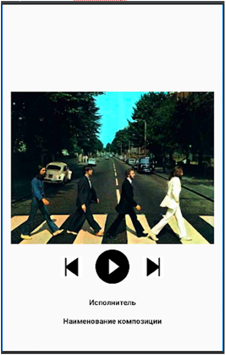
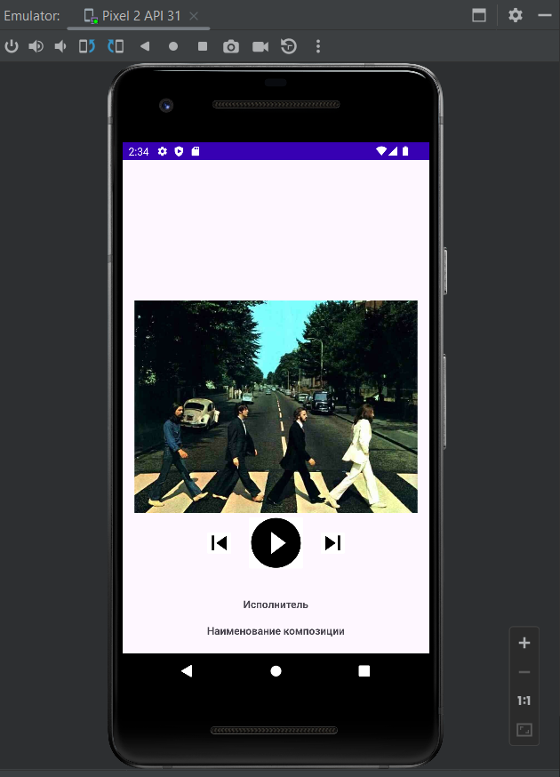

# Урок 3. ConstraintLayout
Цель практической работы:
Применить знания по верстке с помощью ConstraintLayout для создания типового макета мобильного приложения.

Что нужно сделать:
Создайте экран по такому макету, используя только ConstraintLayout в качестве единственной ViewGroup.

Требования:
• Все отступы, кроме отступа кнопки от картинки, равны 16 dp.
• Кнопка Play имеет размеры 80х80.
• Кнопки «Перемотка назад» и «Перемотка вперёд» имеют размеры 40х40 dp и 
выровнены по центру относительно кнопки Play.
• Обложка альбома выровнена по центру экрана как по горизонтали, так и по вертикали.
• TextView «Исполнитель» и «Наименование композиции» выровнены по горизонтали относительно экрана.

==============================================================================
## Демонстрация решения:

